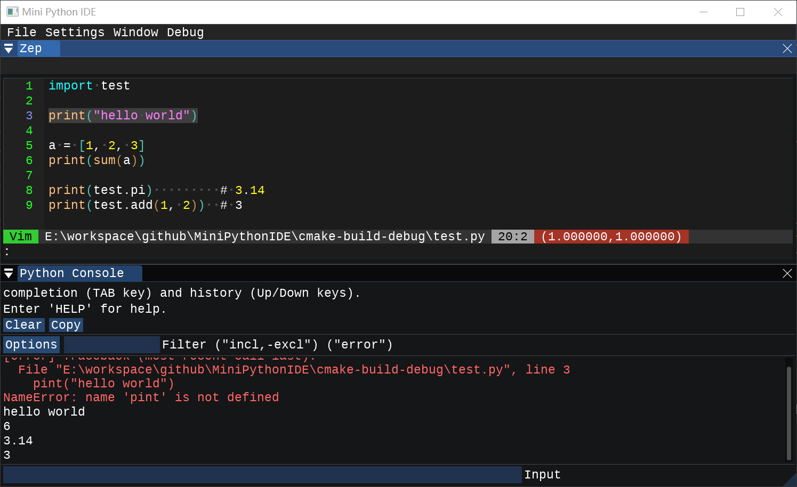

# MiniPythonIDE



A lightweight Python IDE built with Dear ImGui, SDL3, and PocketPy 2.0.

## Features
- Code editor with Python syntax highlighting (powered by ImGuiColorTextEdit)
- Integrated Python console with colored error display
- **Full debugger support** (Step Over, Step Into, Step Out, Breakpoints)
- Variable inspection (local and global)
- Call stack viewing
- File operations (Open, Save with Ctrl+O/Ctrl+S)
- Run Python scripts (F5)
- Modern dark theme

## Build Options

MiniPythonIDE supports optional features that can be enabled or disabled at compile time.

### Debugger Support (Default: ON)

To build without the debugger and reduce binary size:
```bash
cmake -DENABLE_DEBUGGER=OFF ..
```

See [BUILD_OPTIONS.md](BUILD_OPTIONS.md) for detailed configuration options.

## Documentation

- [Debugger Guide](DEBUGGER_GUIDE.md) - Learn how to use the debugging features
- [Build Options](BUILD_OPTIONS.md) - Configure compile-time options
